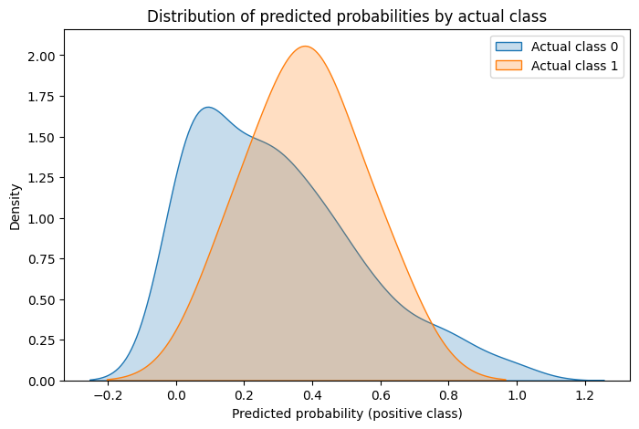

## Modell i kontekst: Fler-stegs beslutningsstøttesystem

Denne modellen inngår som **første trinn i en fler-stegs beslutningsstøtteløsning** for behandling av veisøknader. Arkitekturen kombinerer klassisk maskinlæring, forklarbarhet og språkmodellbasert resonnering.

Hvert trinn har et tydelig avgrenset formål, og ingen enkeltkomponent fatter vedtak alene.

### Steg 1: Prediksjon av sannsynlighet for avslag (Random Forest)
Først kjøres Balanced Random Forest-modellen beskrevet i dette dokumentet.  
Utdata fra dette steget er:

- numerisk sannsynlighet for avslag (0–1)
- en grov klassifisering:
  - lav sannsynlighet for avslag
  - medium sannsynlighet for avslag
  - høy sannsynlighet for avslag
- en forklaring basert på treeinterpreter (se under)

Denne informasjonen:
- vises direkte til brukere i frontend
- mates videre inn i språkmodellen i steg 2

Formålet med steg 1 er å gi en **objektiv, statistisk risikovurdering** basert på historiske data.

Steg 2 og 3 er dokumentert i sine filer

### 1 Trening av modell: train_rf_model.py

## 1.1 Datagrunnlag

- **Datakilde:** Vegdatabank 
- **Tidsperiode:** 2022–2025  
- **Enheter:** 463 Enkeltsaker med registrert vedtaksutfall  
- **Målvariabel:**
  - `Avslag_ind = 1` → Avslag / Avslag etter klage
  - `Avslag_ind = 0` → Ikke avslag

Saker uten registrert vedtak er utelatt.

Datasettet er sterkt ubalansert:
- ca. 97 % ikke-avslag
- ca. 3 % avslag

### 1.1 Grunnvariabler

Modellen benytter blant annet:
- ÅDT, totalt trafikkvolum
- Andel lange kjøretøy
- Fartsgrense
- Antall avkjørsler
- Registrerte trafikkulykker
- Funksjonsklasse
- Bruksområde
- Kurvatur (horisontal og stigning)

Kategoriske variabler er kodet med one-hot encoding.

### 1.2 Konstruerte variabler
For å fange ikke-lineære sammenhenger er følgende variabler konstruert:

| Variabel | Beskrivelse |
|--------|-------------|
| `sving_ind` | Indikerer om vegstrekningen har relevant kurvatur |
| `bakke` | Absoluttverdi av stigning |
| `bakke_ind` | Indikator for stigning > 0.1 |
| `sving_sigmoid` | Glattet funksjon av horisontal kurvatur |
| `antall_lange_kj` | ÅDT × andel lange kjøretøy |

### 1.3 Interaksjonsledd
Det er generert **polynomiske interaksjoner av grad 3**, kun interaksjoner (`interaction_only=True`), uten konstantledd.

Dette gjør det mulig å fange:
- kombinasjonseffekter (f.eks. høy trafikk i kombinasjon med bratt terreng)
- samspill mellom trafikkmengde, vegstandard og kurvatur

## 1.4 Håndtering av klasseubalanse
To metoder benyttes for å håndtere skjev fordeling mellom klassene:

1. **ADASYN-oversampling** av minoritetsklassen i treningssettet
2. **Balanced Random Forest**, der hvert beslutningstre trenes på balanserte utvalg

Dette reduserer risikoen for at modellen ignorerer avslagssaker.

## 1.5 Vurdering av klassifikasjonsresultater
Figuren viser fordelingen av modellens predikerte sannsynlighet for avslag, fordelt på:
- **Faktisk klasse 0 (ikke avslag)**  
- **Faktisk klasse 1 (avslag)**  

Kurvene representerer tetthet (sannsynlighetsfordeling), ikke absolutte tall.

Figuren viser en noe forskjell mellom de to klassene:

- Saker som faktisk ender med **avslag (klasse 1)** har gjennomgående:
  - høyere predikert sannsynlighet
  - tyngdepunkt i området ca. 0,3–0,6
- Saker som faktisk **ikke får avslag (klasse 0)**:
  - dominerer i lavere sannsynligheter
  - har hovedtyngde under ca. 0,2–0,3

Det er betydelig overlapp, noe som er forventet gitt:
- komplekse faglige vurderinger
- begrenset datagrunnlag for avslag
- at avslag avgjøres av forhold som ikke er fullt observerbare i data

---

### 2 Prediksjon basert på modellen `predictions.py`

Prediksjonen i steg 1 utføres av `predictions.py`, som laster den trente Balanced Random Forest-modellen og produserer både prediksjon og forklaring.

## 2.1 Input

Modellen forventer følgende hovedparametere:
- antall avkjørsler
- stigning (bakke)
- ÅDT, total
- andel lange kjøretøy
- fartsgrense
- ev. kurvatur (sving)

Basert på disse konstrueres de interaksjonsleddene modellen er trent på.

### 2.2 Output

Funksjonen `get_rf_prediction()` returnerer enten:
- kun sannsynlighet og klasse, eller
- et forklaringsobjekt med:
  - sannsynlighet i prosent
  - risikokategori
  - faktorer som øker sannsynligheten for avslag
  - faktorer som reduserer sannsynligheten for avslag
  - ferdig formatert forklaringstekst

## 2.3 Forklaringsmekanisme (treeinterpreter)

Forklaringene er basert på `treeinterpreter`, som dekomponerer Random Forest-prediksjonen i:

- **bias** (grunnrisiko)
- bidrag fra hver enkelt feature-interaksjon

Tekniske feature-navn oversettes til lesbare beskrivelser via et eksplisitt `FEATURE_MAP`, for eksempel:

- `"ÅDT, total bakke"` →  
  *Total trafikkmengde per år × kurvatur, stigning*

Forklaringen brukes både:
- direkte i frontend
- som strukturert input til språkmodellen i steg 2

Dette gir:
- høy transparens
- etterprøvbar beslutningsstøtte
- bedre kontroll med språkmodellens begrunnelse

---

### 3 Samlet vurdering
Treningsloggen indikerer at:

- Modellen er stabil og faglig rimelig
- De viktigste variablene er forståelige og konsistente
- Resultatene er godt tilpasset rollen som:
  > kvantitativ risikoskår i steg 1

Begrensningene er tydelige og kjente, og er eksplisitt håndtert gjennom:
- forklarbarhet (treeinterpreter)
- etterfølgende språkmodellvurdering
- egen modell for sakskompleksitet

Modellen vurderes som **egnet for operativ bruk innenfor den beskrevne arkitekturen**, under forutsetning av at den brukes rådgivende og sammen med øvrige trinn i beslutningsstøttesystemet.

---
